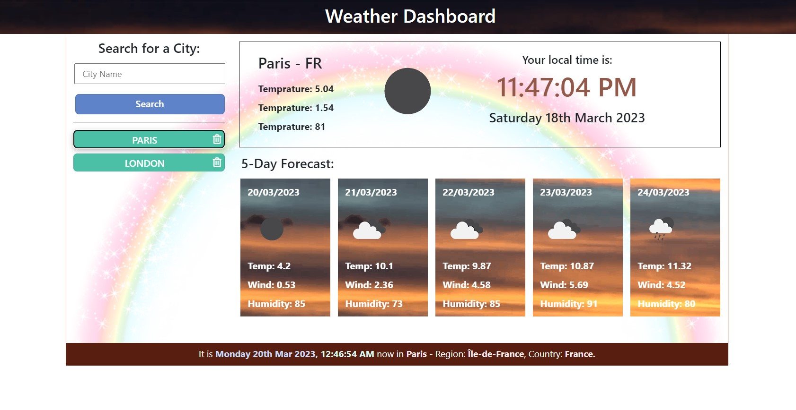

# Weather Dashboard

## Overview

When you consider that there are many weather apps out there, being asked to design one inevitably raises the question. What more can one bring to the table? Then I am comforted by the thought that it is not so much about re-inventing the wheel, rather than feel, uniqueness and appeal of your design.  This is exactly my focus as I set about this task, create something unique, user friendly and above all does the job.

This app will run in a browser, feature dynamically updated HTML and CSS powered by JavaScript and jQuery. I expect it to have a clean, polished, and responsive user interface. 

## Description

The Weather App is designed to give you the current weather information on any City you fancy. Not only will you get the weather details for that day, it will also give you a rough idea of what the weather will be for the next 5 days. Just to give it a tiny bit of uniqueness, as there are many weather apps out there. I thought it would be a good idea to offer the user some more details such as the current time and date of the city searched for. 

## Mock-up

Click [**here.**]( https://rhanciles.github.io/Weather-Dashboard/) to check it out.

## Usage
Without reading any instructions you can start using the App right away because it is that straight forward and easy to us. As you search, it was store your most recent search providing up to 8 buttons for you to click on saving you the need to type that city again. Each individual buttons has a delete icon attached to it, which you can click on if you want to get rid of it. After you have added up to 5 buttons, a clear button will appear which does exactly as described. At the bottom your find some more useful information on the city, such as the time, date, country and region. 

This Repo is made up of the core files and folders related to the task. I have added comments to all the relevant sections of the code, highlighting key areas and the expected result derived from it. The content comprise only that related to the task and I have kept the interface very simple and straight forward to use. It also contains a folder with an animated image of the mock-up depicting the final product. It’s quite straight forward to use, simply click [**here.**]( https://rhanciles.github.io/Weather-Dashboard/) to begin.

## Feedback

Please feel free to reach out or drop a comment here if you have any questions, queries or suggestions. Otherwise, you can find me on the Slack platform Pod 5, just search for Rod.
